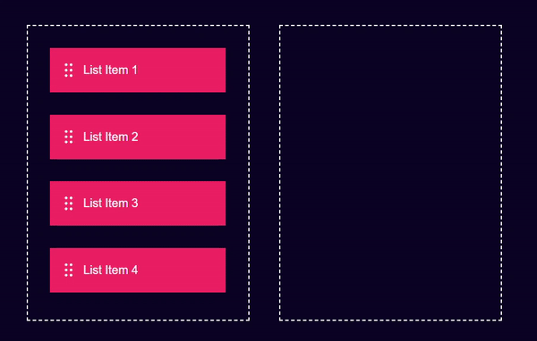

# Drag & Drop 🚀

## Overview
The *Drag & Drop* project is a simple web application that allows users to drag and drop list items between two containers. It's a demonstration of the HTML5 drag and drop API, showcasing the ability to move elements seamlessly from one container to another.

## Technologies Used 🌐
- **HTML**
- **CSS**
- **JavaScript**

## Features 🌟
- List items with drag-and-drop functionality.
- Two containers, allowing users to move items between them.
- Stylish design with a dark theme.

## Usage 💻
1. Open the `index.html` file in a web browser.
2. Drag list items from the left container to the right container and vice versa.

## Live Demo 🌐
Check out the live demo: [Drag & Drop Demo](#) <!-- Add your live demo link -->

## Installation 🛠️
1. Clone the repository: `git clone https://github.com/Eraycann/Drag-Drop`
2. Open the project folder in your code editor.
3. Launch the `index.html` file in a web browser.

## Customization 🎨
- Modify the list item content in the `index.html` file.
- Adjust the overall styling in the `style.css` file to match your preferences.

## Contributing 🤝
Contributions are welcome! Feel free to enhance the design, add new features, or fix any issues. Open a pull request to contribute.

## License 📜
This project is licensed under the [MIT License](LICENSE.md).

## Author ✨
- Eraycan Sivri
- Contact: eraycansivri@hotmail.com

Enjoy exploring the drag-and-drop functionality!
